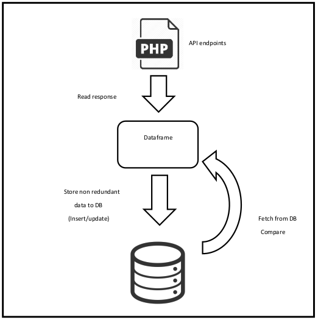

## Threat Intelligence Hub

### What is this?
A system to store, collect and manage blocked_ips and malicious urls, 
collected from the global databases, built with python. This hub offers 
threat APIs to expose the database. Alexa skill to update user about emerging threats.

### Components
1. Threat database
2. Threat APIs
3. Alexa skills

## Threat database 
### Workflow

### Module 1 - IP Address
A collection of blocked IP address updated at specific interval with their
details on following parameters.

| Params | Params | 
| --- | ---|
| reliability    | source|
| priority       | target|
| activity       | dest_port|
| sub_category   | last_online|
| country        | first_seen|
| city           | used_by|
| coordinates    | reference_link|

### Module 2 - Malicious URLs
A collection of malicious URLs updated at specific interval with their
details on following parameters.

| Params | Params | 
| --- | ---|
| domain     | filename|
| file_type  | country|
| priority   | date_added|
| url-status | threat_type|
| threat_tag | date_added|

### Module 3 - Ransomware
A collection of malicious URLs updated at specific interval with their
details on following parameters.

| Params | Params | 
| --- | ---|
| domain     | filename|
| file_type  | country|
| priority   | date_added|
| url-status | threat_type|
| threat_tag | date_added|

## Threat APIs
1. threatdb.leosys.net/api/register
2. threatdb.leosys.net/api/ip/list'
3. threatdb.leosys.net/api/ip/list?revision='
4. threatdb.leosys.net/api/ip/search?ip='
5. threatdb.leosys.net/api/url/list'
6. threatdb.leosys.net/api/url/list?threat_type=phishing'
7. threatdb.leosys.net/api/url/list?threat_type=malware'
8. threatdb.leosys.net/api/url/list?threat_type=ransomware'
9. threatdb.leosys.net/api/url/list?domain=
10. threatdb.leosys.net/api/url/list?filename=
11. threatdb.leosys.net/api/url/search?url=
12. threatdb.leosys.net/api/threats/top/<count>
13. threatdb.leosys.net/api/alarm/alerts

## Alexa Skill

### Note:
* Access the logs in `var/logs/threat_hub.log`
* Any changes in configuration must be updated in `setup.cfg`